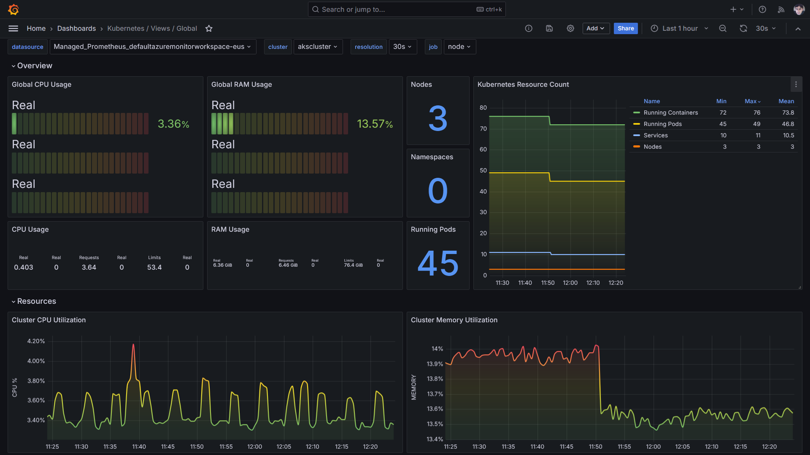
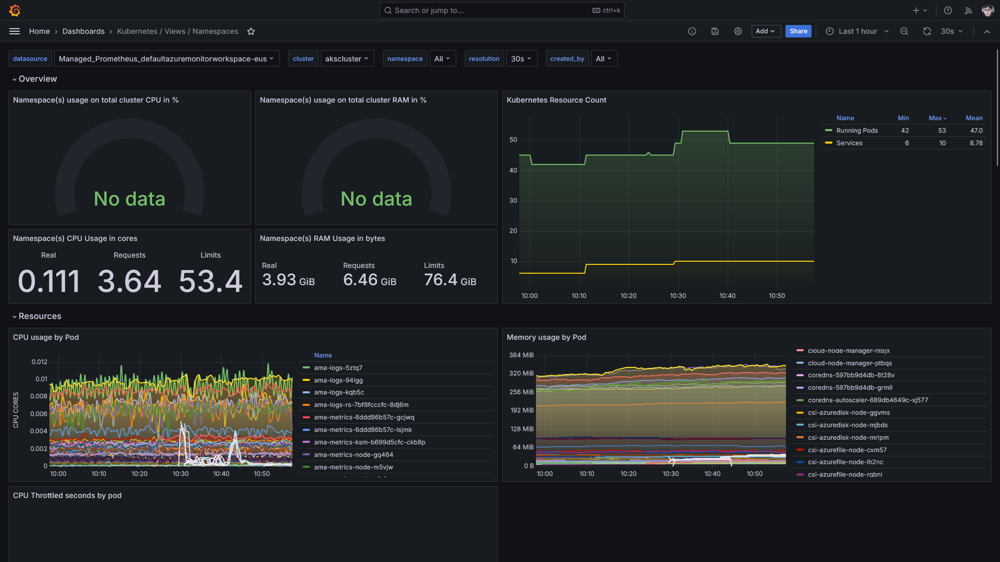
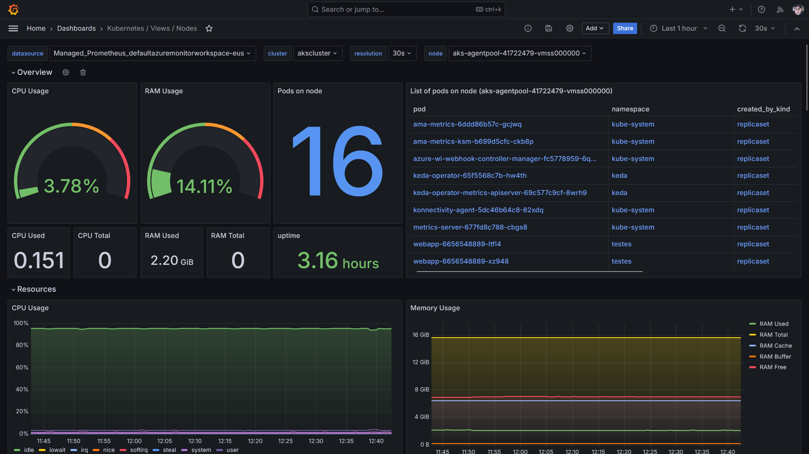
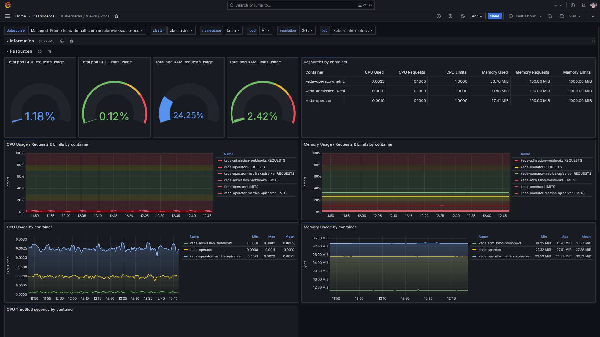

# O projeto grafana-dashboards-kubernetes 
Exemplos de dashboards do Grafana úteis para monitoramento de um cluster Kubernetes e que dependem de métricas do Prometheus.

Os exemplos aqui apresentados integram o projeto **grafana-dashboards-kubernetes**.

Marketplace: https://grafana.com/grafana/dashboards/?search=kubernetes&orderBy=updatedAt&direction=desc

---

## Dashboards do projeto grafana-dashboards-kubernetes

Link do projeto no GitHub: https://github.com/dotdc/grafana-dashboards-kubernetes

---

### Kubernetes / Views / Global

Traz informações sobre os diferentes elementos de um cluster.

Link: https://grafana.com/grafana/dashboards/15757-kubernetes-views-global/

---

### Kubernetes / Views / Namespaces

Útil inclusive para visualizar em que momento um workload escala.

Link: https://grafana.com/grafana/dashboards/15758-kubernetes-views-namespaces/

---

### Kubernetes / Views / Nodes

Visões com os diferentes elementos de um Node.

Link: https://grafana.com/grafana/dashboards/15759-kubernetes-views-nodes/

---

### Kubernetes / Views / Pods

Diferentes insights a nível de Pod(s).

Link: https://grafana.com/grafana/dashboards/15760-kubernetes-views-pods/

